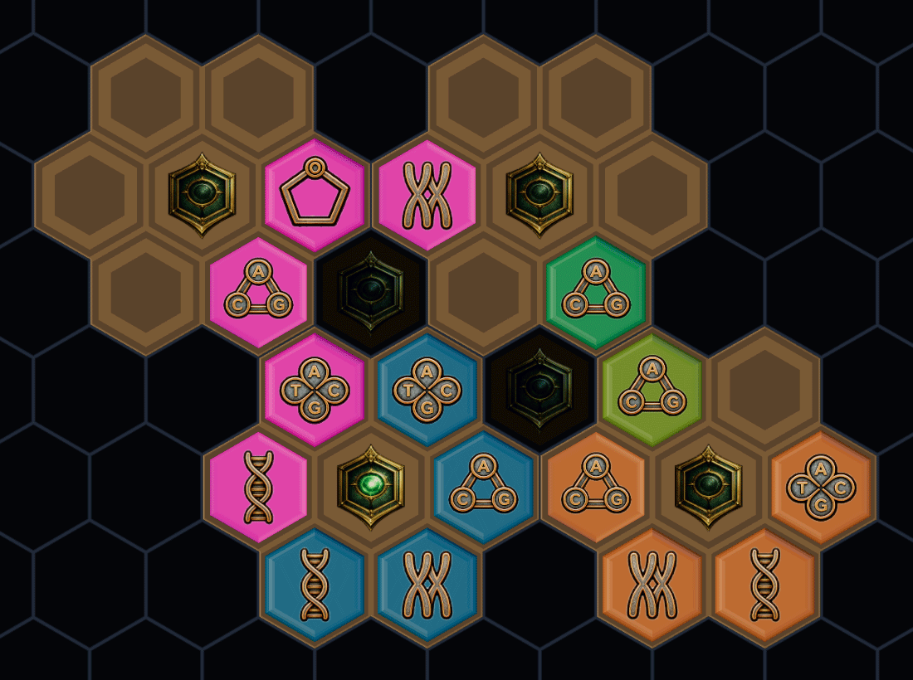
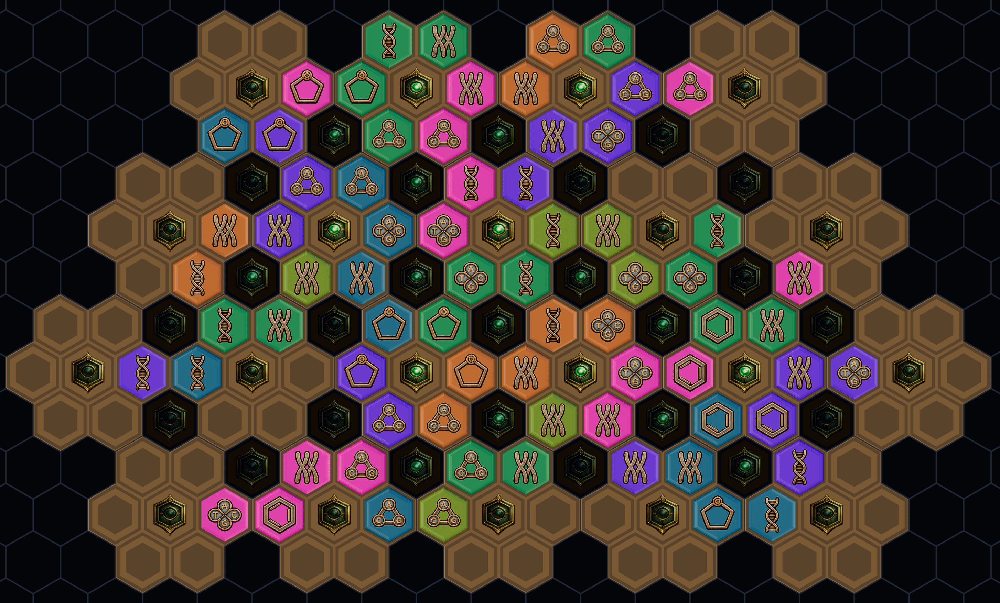
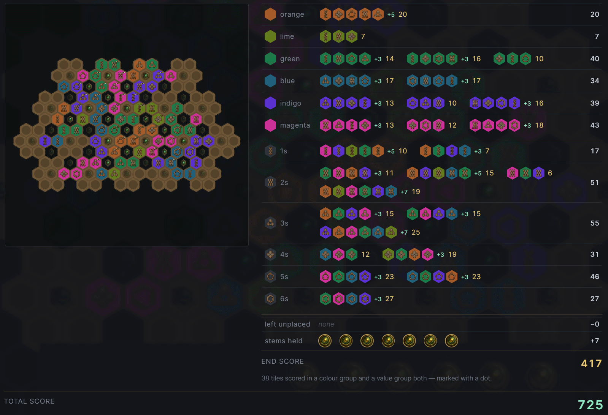

# Hexnome

A tile-drafting and placement game that runs in the browser. You draft tiles out of a shared column,
pay for them from your own drawer, and lay them on hexagonal plates to build a garden that scores
twice over — once each round against that round's targets, and once at the end for everything you
managed to connect.

Solo, or two to four people over a shared link. The rules are their own thing but owe a clear debt to
*Azul: Queen's Garden*; the dark-slate-and-brass look is borrowed from *Opus Magnum*.

**▶ Play it at [hexnome.com](https://hexnome.com)** — nothing to install, no account. Making a game
gives you a link, and whoever opens it takes the next seat.



## The game

Tiles have exactly two attributes — a **colour** (six of them) and a **value** (1–6, drawn as a
symbol from the machinery of a genome, which is where the name comes from). Almost every rule is
about matching one or the other.

- **Take** — a draft is defined by *one* attribute and sweeps up **every** distinct tile in the
  source carrying it. You cannot take the one nice tile and leave the rest.
- **Put** — placing a tile of value *V* costs *V−1* other items out of your drawer, and what may pay
  is constrained by colour, by value, and by a rule that no two equal items may meet in one deal.
- **Pass** — you are out for the rest of the round, so passing is a decision about the round rather
  than about the moment.

The full rulebook is in the game itself (the **?** button), and lives at
[`frontend/src/content/rules.md`](frontend/src/content/rules.md).

<table>
<tr>
<td width="50%"></td>
<td width="50%"></td>
</tr>
<tr>
<td>A few plates in. Each arrives carrying a tile of its own, and extends the board by touching one already there.</td>
<td>Late in a longer game. Plates need not line up on a lattice, so the gaps they leave between them are worth points of their own.</td>
</tr>
</table>

## How the scoring works

The end of a game is the interesting part: every run of touching tiles that shares a colour, or
shares a value, pays the sum of its values plus a bonus for its exact size — and a tile is paid for
by its colour group and its value group both.

[](https://www.youtube.com/watch?v=MvdA41pgyL4)

**[Watch the scoring explained on YouTube →](https://www.youtube.com/watch?v=MvdA41pgyL4)**

That video is about a real finished game, and the game is still there to read:
**[hexnome.com/game?id=05f543db-…](https://hexnome.com/game?id=05f543db-9ba6-4136-ae80-2becc096a472)**.
Opening a game you have no seat in makes you a spectator, so the link is safe to follow — you can
click through both players' boards and every round's sheet without touching anything.

## How it is built

A pnpm workspace of three packages.

| | |
|---|---|
| [`packages/rules`](packages/rules) | The whole game, as dependency-free TypeScript. No framework, no I/O, no clock. |
| [`frontend`](frontend) | Vue 3 + Vite, with the board rendered in three.js through [TresJS](https://tresjs.org). |
| [`backend`](backend) | NestJS + Prisma on MariaDB, plus one WebSocket. |

Three decisions shape everything else:

**A game is a fold over a log.** `replayGame(options, log)` takes the settings and the list of
commands and returns the entire state — board, drawers, source, scores. Commands are *intents*
(`{ kind: 'put', … }`), never effects, so nothing about a game in progress is stored anywhere except
that log and therefore nothing can drift from it. The rules package is shared verbatim, so the
browser and the server fold the same commands through the same code.

**The database adjudicates concurrency, not the application.** Every command names the `seq` it was
built on, and `@@unique([gameId, prevSeq])` means two players racing on one turn resolve at the
insert: one row lands, the other violates the constraint. The loser gets a 409, catches up and
retries. There is no lock and no transaction doing this work — the index is the design.

**What is broadcast is a number.** The head socket pushes `{ gameId, seq }` and nothing else — "the
table moved, come and look". It carries no game data, so it can be sent to anyone holding the id, and
a client that misses a message is only as stale as its 15-second backstop poll.

Seats work the same way. Claiming one is an `UPDATE … WHERE token IS NULL`, so two people opening the
same link cannot both take the chair, and the token that comes back is the only proof of a seat — it
leaves the server exactly once.

Roughly 800 tests across the three packages, most of them in the rules.

## Running it

Needs Node 22+, pnpm, and a MySQL/MariaDB you can create a database in.

```bash
pnpm install

# Backend: point it at a database and push the schema.
cp backend/.env.example backend/.env      # then edit DATABASE_URL
pnpm --filter @hexnome/backend prisma:generate
pnpm --filter @hexnome/backend prisma:push

pnpm dev                                  # frontend on :5173, backend on :3000
```

The frontend needs no configuration — it calls `/api`, which the Vite dev server proxies to the
backend exactly as nginx does in production. See [`frontend/.env.sample`](frontend/.env.sample) if
you want to point a local frontend at a deployed backend instead.

```bash
pnpm test        # all three suites
pnpm typecheck
pnpm lint
pnpm build
```

## Repository

- [`docs/game-design.md`](docs/game-design.md) — the rules as designed, and the open questions.
  Checked against the code by a test, so it cannot quietly go stale.
- [`docs/tech-spec.md`](docs/tech-spec.md) — architecture, rendering, interaction.
- [`docs/art-spec.md`](docs/art-spec.md) — what art the game needs and how it was produced.
- [`docs/backend-attempt1.md`](docs/backend-attempt1.md) — the first backend, and why it was thrown
  away.
- [`settings/`](settings) — the nginx site, the pm2 config and the deploy scripts running
  hexnome.com.
- [`session-logs/`](session-logs) — every prompt that built this. The project was written with
  [Claude Code](https://claude.com/claude-code), and `build.py` turns the transcripts into a numbered
  record of what was actually asked for.
